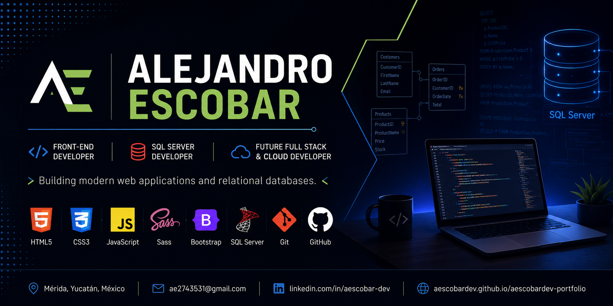

  

# ¡Hola! Soy Alejandro Escobar 👋

---

## 👨‍💻 Sobre mí

Soy un **Front-End Developer** apasionado por el desarrollo web y el aprendizaje continuo.

Actualmente estoy fortaleciendo mis conocimientos en **SQL Server**, **T-SQL**, **diseño de bases de datos relacionales** y preparándome para convertirme en un **Full Stack Developer**, con el objetivo de especializarme posteriormente en tecnologías **Cloud (AWS)**.

---

## 🚀 Actualmente

- 💻 Desarrollando proyectos de Front-End con HTML, SCSS y JavaScript.
- 🗄️ Construyendo un portafolio profesional de SQL Server.
- 📚 Profundizando en T-SQL, Stored Procedures, Views y Functions.
- 🌐 Mejorando continuamente mis proyectos personales y documentación.
- ☁️ Preparándome para especializarme en Cloud Computing con AWS.

---

## 🛠 Tecnologías

| Área | Tecnologías |
|------|-------------|
| 🌐 Front-End | HTML5, CSS3, Sass (SCSS), Bootstrap, JavaScript |
| 🗄️ Bases de Datos | SQL Server, T-SQL, AdventureWorks, Modelado ER, Normalización |
| 🛠 Herramientas | Git, GitHub, Visual Studio Code, SQL Server Management Studio (SSMS) |
| 📚 Actualmente aprendiendo | Full Stack Development, Cloud Computing, AWS |

---

## 📂 Proyectos Destacados

🛒 Adidas E-Commerce

E-commerce responsive desarrollado con HTML, SCSS y JavaScript.

🎾 Nika Tennis Club

Sitio web corporativo moderno para un club deportivo.

💼 Portfolio Personal

Mi portafolio profesional con proyectos y experiencia.

### 🌐 Desarrollo Web

- 🛒 Adidas E-Commerce Frontend
- 🎾 Nika Tennis Club
- 💼 Portfolio Personal

### 🗄️ Bases de Datos

- 💾 SQL Server Portfolio *(Próximamente)*
- 📊 AdventureWorks SQL Labs *(Próximamente)*
- 🗃️ Database Design Projects *(Próximamente)*

---

## 🎯 Objetivo Profesional

Mi objetivo es desarrollar aplicaciones web modernas, escalables y bien estructuradas, fortaleciendo continuamente mis conocimientos en **Front-End**, **Bases de Datos**, **Back-End** y **Cloud Computing**, para convertirme en un **Full Stack Developer**.

---

## 📫 Contacto

- 💼 LinkedIn: https://www.linkedin.com/in/aescobar-dev
- 🌐 Portfolio: https://aescobardev.github.io/aescobardev-portfolio/
- 📧 Email: ae2743531@gmail.com

---

# 📊 GitHub Stats

---

# 🔥 Contribution Streak

---

# 📈 Contribution Graph

---

# 🏆 GitHub Trophies

---

# 🗺️ Roadmap Profesional

Frontend
██████████ 100%

Git
██████████ 100%

SQL Server
████████░░ 80%

React
██░░░░░░░░ 20%

Node.js
█░░░░░░░░░ 10%

AWS
░░░░░░░░░░ 0%

## ✅ Completado

- HTML5
- CSS3
- JavaScript
- Sass (SCSS)
- Bootstrap
- Git
- GitHub
- SQL Server
- T-SQL
- Modelado de Bases de Datos
- AdventureWorks
- Diseño de Bases de Datos Relacionales

## 🚧 Actualmente

- SQL Server Avanzado
- Stored Procedures
- Views
- User Defined Functions
- Optimización de Consultas

## 🎯 Próximos Objetivos

- React
- Node.js
- Express.js
- APIs REST
- AWS Cloud
- Docker
- Full Stack Development

## 💡 Especialidades

✔ Desarrollo Front-End

✔ Diseño Responsivo

✔ SQL Server

✔ Modelado de Bases de Datos

✔ T-SQL

✔ Git y GitHub

✔ Resolución de Problemas

✔ Aprendizaje Continuo

⭐ Gracias por visitar mi perfil.
